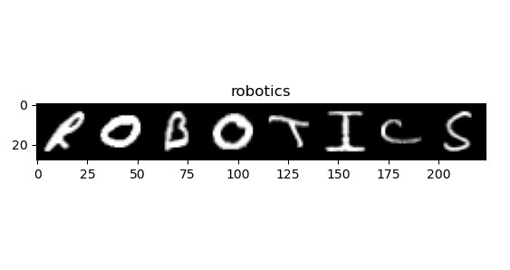
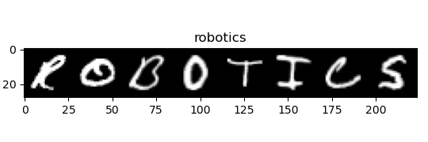

# Handwriting-Recoginition-System
Project for ESE650 learning in robotics: a handwriting recognition system using HMM.

# To use the system 
You may need to go to the utils fold and call handwritten_data_utils.py to generate the dataset locally. Before that you may add the repo path to your PYTHONPATH. Also make sure, git lfs is installed to download the files for this project

# Contribution

Haoxiang You: 
1. Write up start point codes and basic utils.
2. Implement for HMM and associate algorithms.
3. Analyze for result and improve the performance.

Jia Shen:
1. Design and implement the observer.
2. Write up useful utils for analysis.
3. Analyze for result and improve the performance.

# Demo

### Prediction results of different algorithm

|Max likelihood | Bayes Filter  | Smooth | Viterbi |
|---|---|---|---|
  |  | |

# Report:

Available [Here](ESE650_Project_Report.pdf)
